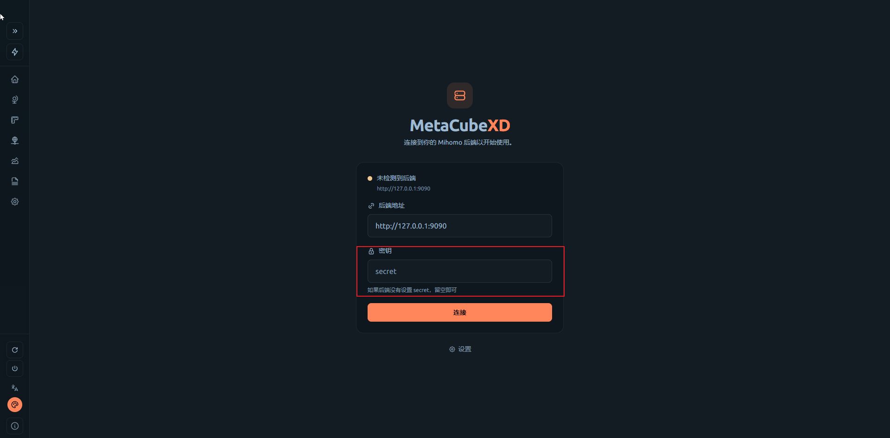
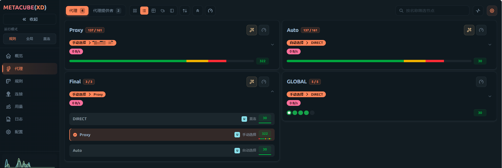

# Mihomo Bash Kit 部署指南

这是一套用于 Linux + Bash 的 Mihomo 部署脚本。

发布包只包含安装、订阅、进程管理和 Bash 集成脚本，**不包含 Mihomo 可执行文件、个人订阅、代理节点、Controller 密钥、Geo 数据库或 Web UI**。部署时，脚本会按“镜像地址优先、GitHub 官方地址兜底”的顺序下载所需文件。

## 默认配置

部署后默认使用以下配置：

| 项目 | 默认值 |
| --- | --- |
| Mihomo 配置目录 | `~/.mihomo` |
| Mihomo 用户级安装位置 | `~/.local/bin/mihomo` |
| 混合代理地址 | `http://127.0.0.1:6669` |
| Controller | `127.0.0.1:9090` |
| DNS 监听 | `127.0.0.1:1053` |
| Web UI | `http://127.0.0.1:9090/ui/` |
| Controller 密钥 | `~/.mihomo/secret` |

默认只允许本机访问，不会直接向局域网或公网开放端口。

## 第 1 步：安装系统依赖

Debian/Ubuntu 普通用户（可以使用 `sudo`）：

```bash
sudo apt update
sudo apt install -y curl gzip git ca-certificates coreutils iproute2
```

已经切换到 `root` 用户时，不要加 `sudo`：

```bash
apt update
apt install -y curl gzip git ca-certificates coreutils iproute2
```

脚本支持以下 CPU 架构：

- `x86_64` / `amd64`
- `aarch64` / `arm64`

## 第 2 步：获取部署包

从 GitHub 克隆：

```bash
git clone https://github.com/xqy-2025/mihomo-bash-kit.git
cd mihomo-bash-kit
```

如果使用下载的压缩包：

```bash
tar -xzf mihomo-bash-kit-20260906.tar.gz
cd mihomo-bash-kit
```

## 第 3 步：安装管理脚本和 Bash 命令

执行：

```bash
./install.sh
source ~/.bashrc
```

安装器会：

1. 把核心脚本复制到 `~/.mihomo`。
2. 自动生成 `~/.mihomo/secret`，权限设为 `0600`。
3. 在 `~/.bashrc` 中加入 Mihomo 加载入口。
4. 提供 `mihomo-start`、`mihomo-stop`、`proxy-on` 等命令。

重复运行 `./install.sh` 不会重复写入 Bash 配置，也不会覆盖已有订阅、配置、密钥或运行数据。

## 第 4 步：下载并安装 Mihomo

发布包中没有 Mihomo 二进制，需要执行：

```bash
bash ~/.mihomo/install_mihomo.sh
```

脚本默认安装 Mihomo `v1.19.27`，并按以下顺序尝试下载：

1. `hub.gitmirror.com` 镜像
2. `gh.llkk.cc` 镜像
3. `gh-proxy.com` 镜像
4. `ghfast.top` 镜像
5. GitHub 官方 Release 地址

普通用户存在 `sudo` 时，脚本优先安装到：

```text
/usr/local/bin/mihomo
```

没有 `sudo` 或授权失败时，会安装到：

```text
~/.local/bin/mihomo
```

如需安装其他版本：

```bash
MIHOMO_VER=v1.19.27 bash ~/.mihomo/install_mihomo.sh
```

将 `v1.19.27` 替换为目标版本号即可。

如果所有自动下载地址都不可用，也可以从 [Mihomo 官方 Releases](https://github.com/MetaCubeX/mihomo/releases) 手动下载对应架构的 Linux 压缩包，然后安装：

```bash
gzip -dc mihomo-linux-amd64-VERSION.gz > mihomo
chmod 0755 mihomo
mkdir -p ~/.local/bin
install -m 0755 mihomo ~/.local/bin/mihomo
mihomo -v
```

ARM64 用户需要把文件名中的 `amd64` 换成 `arm64`。

## 第 5 步：下载 Geo 数据

执行：

```bash
bash ~/.mihomo/install_geo.sh
```

该脚本会下载 `Country.mmdb`，同样先尝试镜像地址，最后尝试 GitHub 官方地址，并安装到 `~/.mihomo`。

如果自动下载失败，可以从 [Meta rules dat Releases](https://github.com/MetaCubeX/meta-rules-dat/releases) 手动下载 `country.mmdb`，然后执行：

```bash
install -m 0644 country.mmdb ~/.mihomo/Country.mmdb
install -m 0644 country.mmdb ~/.mihomo/country.mmdb
```

## 第 6 步：安装 Web UI

执行：

```bash
bash ~/.mihomo/install_ui.sh
```

脚本会先通过镜像克隆 MetaCubeXD 的 `gh-pages` 分支，全部镜像失败后再访问 GitHub 官方仓库。

Web UI 是可选组件；不安装 Web UI 也可以正常使用 Mihomo 代理和命令行管理功能。

## 第 7 步：增加订阅

增加 URL 订阅：

```bash
bash ~/.mihomo/sub_add.sh my-sub url 'https://example.com/你的订阅链接'
```

请务必用单引号包住订阅链接，避免 `&` 等字符被 Bash 解释。将 `my-sub` 换成便于识别的订阅名称；名称只能包含英文、数字、下划线、点和短横线。

例如增加第二个订阅：

```bash
bash ~/.mihomo/sub_add.sh backup-sub url 'https://example.com/另一个订阅链接'
```

增加本地 Provider 文件：

```bash
bash ~/.mihomo/sub_add.sh local-sub file '/完整路径/provider.yaml'
```

查看已有订阅：

```bash
bash ~/.mihomo/sub_manage.sh list
```

URL 会保存在本机的 `~/.mihomo/subscriptions.tsv` 中。查看列表时会隐藏 URL，避免直接显示 Token。

如果需要更新某个订阅，使用相同名称重新执行增加命令：

```bash
bash ~/.mihomo/sub_add.sh my-sub url 'https://example.com/更新后的订阅链接'
```

删除订阅：

```bash
bash ~/.mihomo/sub_del.sh my-sub
```

每次增加、更新或删除订阅时，脚本都会重新生成 `~/.mihomo/config.yaml`。如果已经安装 Mihomo，还会自动检查新配置是否有效。

## 第 8 步：检查配置并启动

检查 Mihomo 程序和配置：

```bash
mihomo-check
```

检查通过后启动 Mihomo：

```bash
mihomo-start
```

确认运行状态和监听端口：

```bash
mihomo-status
```

此时先确认 Mihomo 正常运行。代理连通性测试放到完成 Web UI 登录和节点选择之后。

## 第 9 步：从 Windows 通过 SSH 访问 Web UI

Mihomo 默认只监听服务器本机的 `127.0.0.1`。Windows 不需要开放服务器的 `9090` 端口，也不需要启用局域网访问；使用 SSH 本地端口转发更安全。

在 Windows PowerShell 或 Windows Terminal 中执行：

```powershell
ssh -N -T `
  -o ExitOnForwardFailure=yes `
  -o ServerAliveInterval=30 `
  -L 9090:127.0.0.1:9090 `
  用户名@服务器IP
```

把 `用户名` 和 `服务器IP` 换成实际 SSH 登录信息。命令运行后窗口不会返回提示符，这是正常现象；请保持该窗口打开。

如果 SSH 服务不是默认的 `22` 端口，例如使用 `2222`：

```powershell
ssh -p 2222 -N -T `
  -o ExitOnForwardFailure=yes `
  -o ServerAliveInterval=30 `
  -L 9090:127.0.0.1:9090 `
  用户名@服务器IP
```

隧道建立后，在 Windows 浏览器打开：

```text
http://127.0.0.1:9090/ui/
```

如果还希望让 Windows 软件使用服务器上的 Mihomo 代理，可以同时转发 `6669`：

```powershell
ssh -N -T `
  -o ExitOnForwardFailure=yes `
  -o ServerAliveInterval=30 `
  -L 9090:127.0.0.1:9090 `
  -L 6669:127.0.0.1:6669 `
  用户名@服务器IP
```

此时 Windows 上的代理地址为 `127.0.0.1:6669`。结束使用时，在 SSH 窗口按 `Ctrl+C` 关闭隧道。

## 第 10 步：填写 Controller Secret

在 Mihomo 服务器的终端中读取密钥：

```bash
cat ~/.mihomo/secret
```

回到 Windows 浏览器中的 MetaCubeXD：

1. 后端地址保持为 `http://127.0.0.1:9090`。
2. 把命令输出的完整内容粘贴到“密钥”输入框。
3. 点击“连接”。



不要把该密钥、`config.yaml`、`subscriptions.tsv` 或 `providers/` 上传到 GitHub，也不要把真实密钥截进公开图片。

## 第 11 步：在 Web UI 中选择代理节点

连接 MetaCubeXD 后，进入左侧的“代理”页面：

1. 在 `Proxy` 策略组中选择需要使用的实际代理节点。
2. 在 `Final` 策略组中选择 `Proxy`。
3. 如果希望自动选择延迟较低的节点，可以在 `Final` 中改选 `Auto`。



## 第 12 步：日常管理命令

```bash
mihomo-start       # 启动
mihomo-stop        # 停止
mihomo-restart     # 重启
mihomo-status      # 查看状态
mihomo-check       # 检查程序和配置
mihomo-log         # 查看最近日志
mihomo-log -f      # 持续查看日志
mihomo-test        # 测试代理访问
proxy-on           # 为当前终端开启代理环境变量
proxy-off          # 清除当前终端代理环境变量
proxy-status       # 查看当前代理环境
```

## 可选：修改端口

在增加或更新订阅时指定端口：

```bash
MIHOMO_MIXED_PORT=7890 \
MIHOMO_CONTROLLER_PORT=9091 \
MIHOMO_DNS_PORT=1054 \
bash ~/.mihomo/sub_add.sh my-sub url 'https://example.com/你的订阅链接'
```

如果修改混合代理端口，还需要在 `~/.bashrc` 中设置相同的地址：

```bash
export PROXY_ADDR=http://127.0.0.1:7890
```

然后重新加载：

```bash
source ~/.bashrc
```

## 可选：允许可信局域网访问

默认配置最安全，只允许本机访问。确实需要局域网访问时，使用以下参数重新增加或更新订阅：

```bash
MIHOMO_ALLOW_LAN=true \
MIHOMO_BIND_ADDRESS='*' \
MIHOMO_CONTROLLER_HOST=0.0.0.0 \
bash ~/.mihomo/sub_add.sh my-sub url 'https://example.com/你的订阅链接'
```

随后重启：

```bash
mihomo-restart
```

局域网模式会开放代理端口和 Controller。请保管好 `~/.mihomo/secret`，使用防火墙限制可信网段，不要直接暴露到公网。
